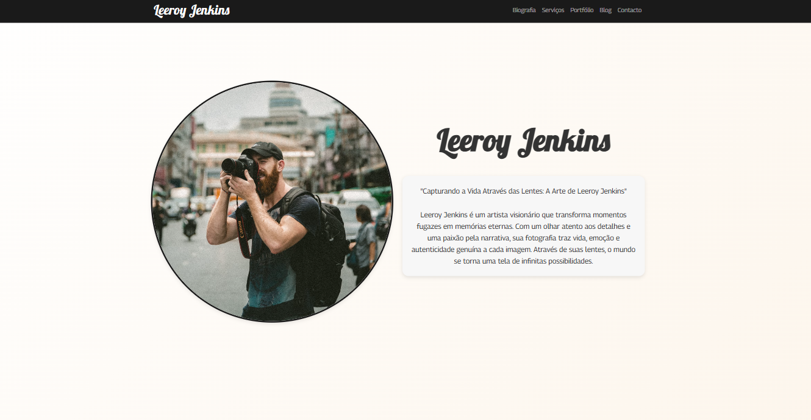

# Leeroy Jenkins - web portfólio para fotógrafo

Descubra a identidade e o trabalho de um visionário e fictício fotógrafo, em um website interativo criado e modelado por Guilherme Carasek, Lucas Fonseca e Rúben Pereira como projeto de estudo em WEB Develpment
## Conteúdo:
### 1. Página inicial
- Autobiografia.
- Lista de Serviços, suas descrições e preços.
- Formulário para contacto com o fotógrafo. 
### 2. Portfólio
- Organizado por temas
    -  Retratos
    -  Paisagens
    -  Eventos
- Carrosséis dinâmicos
### 3. Blog
- Artigos que revelam a criatividade e métodos do fotógrafo
- Secção de comentários
    - Comentários
    - Likes
    - Respostas 
### Ferramentas que utilizamos
- **Figma:** design do layout, escolha de cores, formatação de imagens
- **Visual Studio Code:** escrita do código
- **HTML5, CSS3, JavaScript:** linguagens utilizadas
- **Bootstrap, Google Fonts, FontAwesome:** bibliotecas e frameworks
- **Github:** versionamento, controle e backup
### Equipa
- **Guilherme Carasek**
- **Lucas Fonseca**
- **Rúben Pereira**
